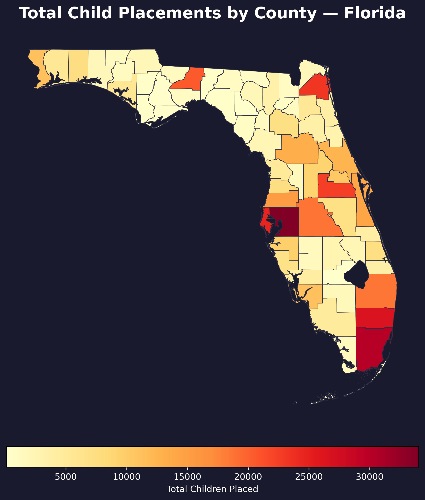
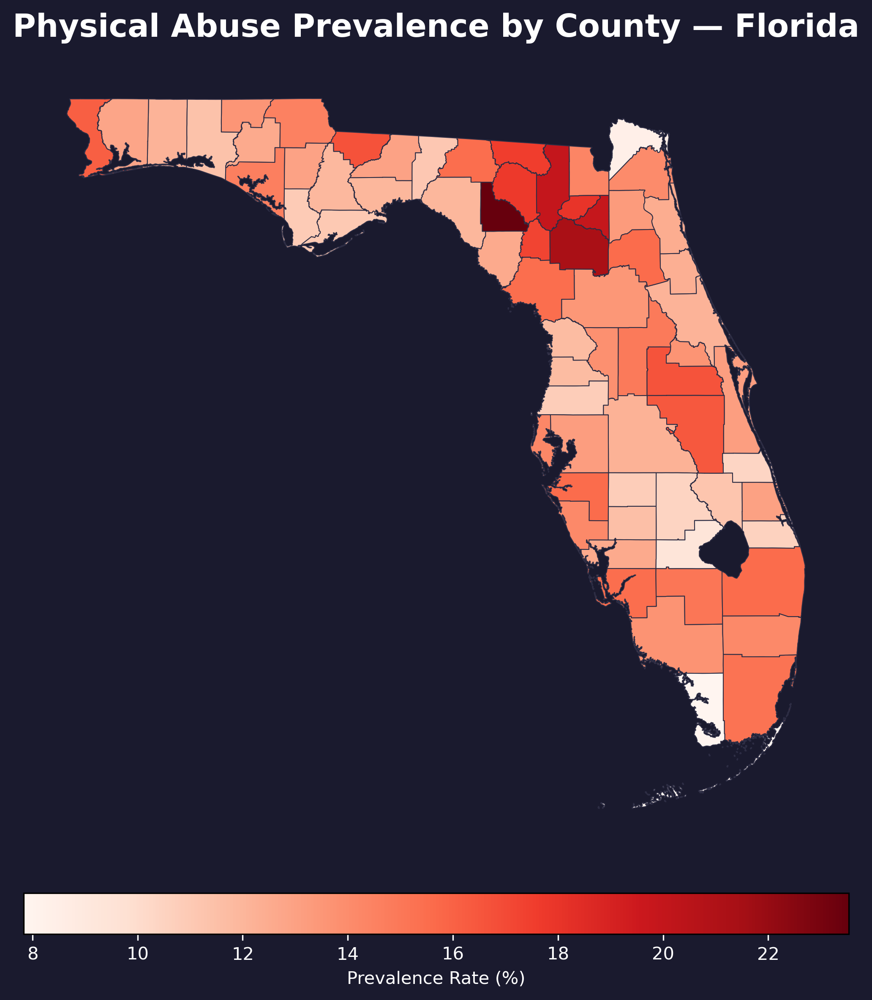
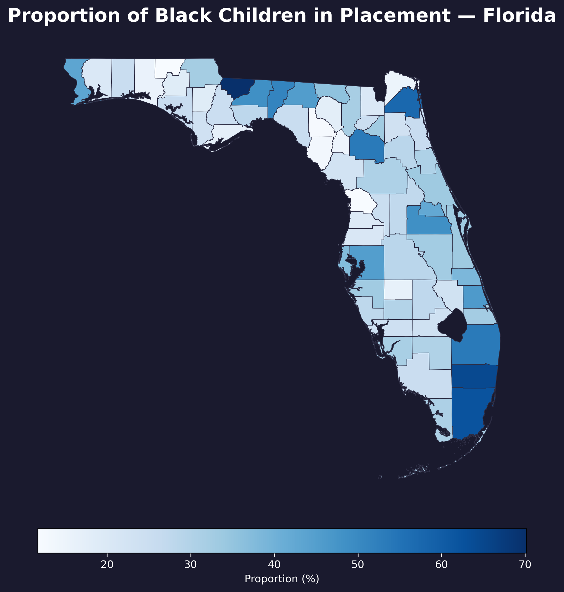
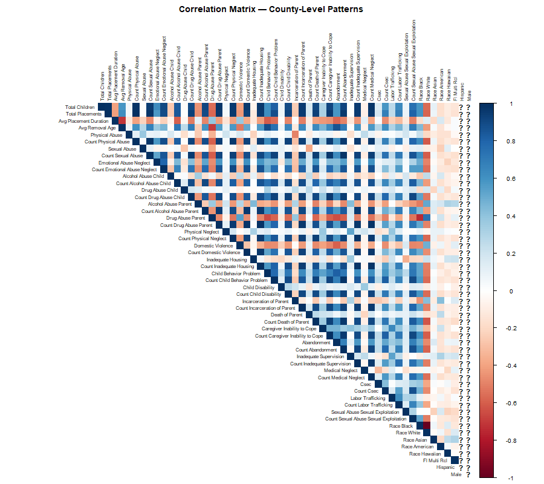
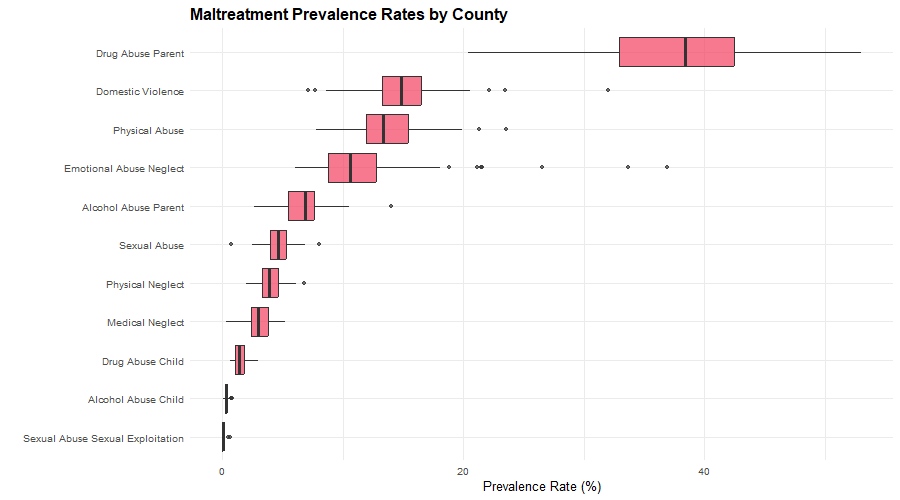
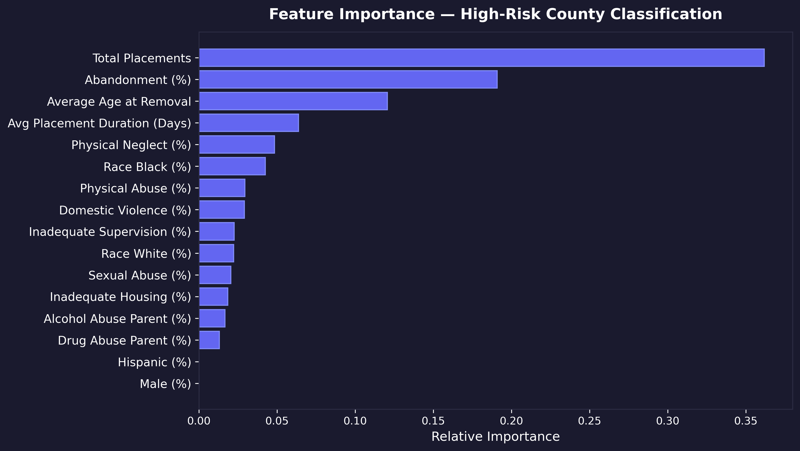
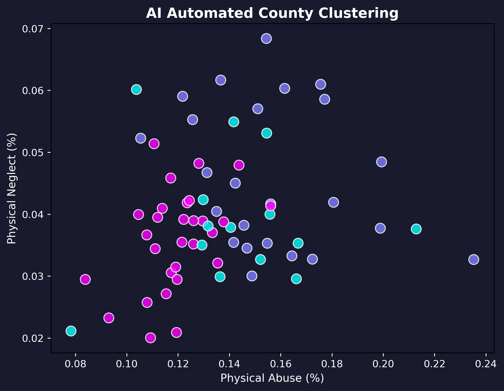

# Florida Child Placement Intelligence Insights

## Overview
This project provides a comprehensive Geospatial and Statistical Analysis of Child Placement Patterns in Florida. It processes large DCF placement history datasets alongside child demographics to uncover insights about placement durations, abuse profiles, and geographic hotspots. The end goal is to deliver actionable intelligence via an interactive Power BI dashboard and machine learning profiles.

## Project Structure
- `Child Placement Dataset/`: Source CSV data (DCF placement history, demographics).
- `Counties (1)/`: Shapefiles used for Florida GIS mapping.
- `scripts/`: Source code modules detailing each pipeline step.
  * `step1_data_cleaning.py`: Handles raw data ingestion, deduplication, and datetime parsing.
  * `step2_zip_to_county.py`: Maps zipcode data to specific counties using spatial and logical crosswalks.
  * `step3_aggregation.py`: Aggregates the cleaned data strictly at the county level.
  * `step4_gis_mapping.py`: Generates choropleth maps to visualize placements across Florida.
  * `step5_statistical_analysis.R`: R script generating descriptive statistics, histograms, and correlation matrices.
  * `step6_ml_classification.py`: Uses Random Forest to predict placement durations based on abuse factors and demographics.
  * `step7_powerbi_export.py`: Prepares combined and dimension tables specifically for the interactive Power BI dashboard.
  * `step8_ai_layer.py`: Employs KMeans clustering to build actionable "AI Personas" for different counties based on their key metrics.
- `outputs/`: Automatically generated directory containing output maps (`/maps`), statistics (`/stats`), ML models/plots (`/ml`), Power BI dimensions (`/powerbi`), and AI insights (`/ai_insights`).

## Setup and Requirements
1. **Python dependencies:** Install via `pip install -r requirements.txt`. (Requires `pandas`, `geopandas`, `matplotlib`, `scikit-learn`, etc).
2. **R dependencies:** Ensure R is installed (default path `C:\Program Files\R\R-4.5.3\bin\Rscript.exe`). The R script will automatically install required packages like `ggplot2` and `corrplot`.

## How to Run the Pipeline
The entire data engineering and machine learning pipeline can be run with a single command:
```bash
python run_full_pipeline.py
```
This script sequentially executes Steps 1 through 8. It also validates the return codes of each script, halting if any errors occur, and copies the generated artifacts (maps, text reports, CSVs) to the assigned destinations.

## Power BI Integration
Inside the `outputs/powerbi/` folder, you will find `County_Stats_Dim.csv`. Load this dataset directly into Power BI to recreate the "Florida Child Placement Intelligence Insights" dashboard. Key metrics include:
- Total Placements
- Average Age
- High Risk Counties
- Placement Trend Over Time
- Geographic Distribution
- Child Placement Drivers (Abuse Factors)

## Documentation
- `PRD.md`: Product Requirements Document containing project objectives and feature scope.
- `TRD.md`: Technical Requirements Document containing exact data flows, schemas, and system architecture.
- `Project_Explanation.pdf`: A concise, one-page high-level summary of the project.

## Sample Visualizations

Here are some insights generated by our fully automated data pipeline:

### 1. Geospatial Analysis




### 2. Statistical Analysis



### 3. Machine Learning Predictors & AI Personas



