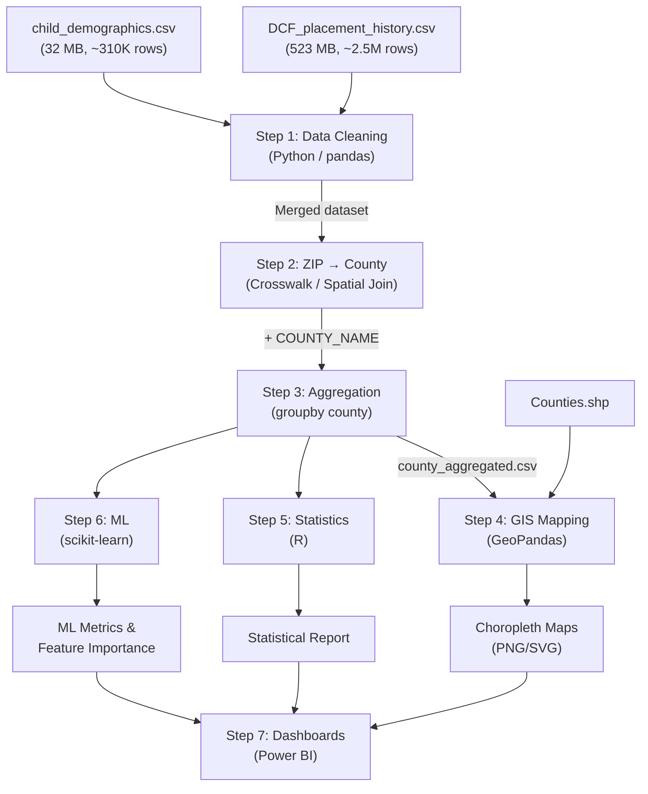

# 🔧 Technical Requirements Document (TRD)

## Geospatial and Statistical Analysis of Child Placement Patterns in Florida

| Field | Detail |
|---|---|
| **Project Title** | Geospatial and Statistical Analysis of Child Placement Patterns in Florida |
| **Author** | Sriram |
| **Date** | March 17, 2026 |
| **Version** | 1.0 |
| **Status** | Draft |

---

## 1. System Architecture Overview

```
┌─────────────────────────────────────────────────────────────────────┐
│                        DATA LAYER                                   │
│  DCF_placement_history.csv  │  child_demographics.csv  │ Counties.shp│
└──────────────┬──────────────┴──────────────┬───────────┴─────┬──────┘
               │                             │                 │
               ▼                             ▼                 ▼
┌─────────────────────────────────────────────────────────────────────┐
│                  STEP 1 — DATA CLEANING (Python)                    │
│  • pandas load & merge on AFCARS_ID                                 │
│  • Date parsing, null handling, ZIP standardization                 │
└──────────────────────────────┬──────────────────────────────────────┘
                               ▼
┌─────────────────────────────────────────────────────────────────────┐
│             STEP 2 — ZIP → COUNTY MAPPING (Python)                  │
│  • HUD ZCTA crosswalk lookup  OR  spatial join via GeoPandas        │
│  • Output: COUNTY_NAME column appended                              │
└──────────────────────────────┬──────────────────────────────────────┘
                               ▼
┌─────────────────────────────────────────────────────────────────────┐
│               STEP 3 — AGGREGATION (Python)                         │
│  • groupby('COUNTY_NAME') → children_count, maltreatment rates     │
│  • Demographic breakdowns per county                                │
│  • Export: county_aggregated.csv                                    │
└────────────┬─────────────────┬──────────────────┬───────────────────┘
             │                 │                  │
             ▼                 ▼                  ▼
┌────────────────┐  ┌──────────────────┐  ┌──────────────────────────┐
│ STEP 4 — GIS   │  │ STEP 5 — STATS   │  │ STEP 6 — ML              │
│ (Python)        │  │ (R)              │  │ (Python)                 │
│ GeoPandas merge │  │ summary()        │  │ RandomForestClassifier   │
│ Choropleth maps │  │ lm() regression  │  │ high_risk label          │
│ PNG/SVG export  │  │ Correlation      │  │ Accuracy / F1 metrics    │
└────────┬───────┘  └────────┬─────────┘  └────────────┬─────────────┘
         │                   │                         │
         ▼                   ▼                         ▼
┌─────────────────────────────────────────────────────────────────────┐
│            STEP 7 — VISUALIZATION & REPORTING                       │
│  • Power BI-ready CSVs   • Map images   • Model report              │
└─────────────────────────────────────────────────────────────────────┘
```

---

## 2. Technology Stack

| Layer | Technology | Version | Purpose |
|---|---|---|---|
| **Language** | Python | 3.10+ | Data cleaning, GIS, ML |
| **Language** | R | 4.3+ | Statistical analysis |
| **Data** | pandas | 2.x | DataFrame operations |
| **GIS** | GeoPandas | 0.14+ | Spatial joins, choropleth maps |
| **GIS** | matplotlib | 3.x | Map rendering |
| **ML** | scikit-learn | 1.3+ | Random Forest, metrics |
| **Stats (R)** | base R | — | `summary()`, `lm()` |
| **Stats (R)** | ggplot2 | 3.x | Statistical visualizations |
| **Viz** | Power BI | Desktop | Dashboard (Phase 2) |
| **GIS (Future)** | ArcGIS Pro | 3.x | Advanced spatial analytics |

### 2.1 Python Dependencies

```txt
# requirements.txt
pandas>=2.0.0
geopandas>=0.14.0
matplotlib>=3.7.0
scikit-learn>=1.3.0
openpyxl>=3.1.0
shapely>=2.0.0
pyproj>=3.6.0
fiona>=1.9.0
```

### 2.2 R Dependencies

```r
# install.R
install.packages(c("tidyverse", "ggplot2", "corrplot", "sf"))
```

---

## 3. Project Directory Structure

```
E:\VSC\GIS pro\
│
├── Child Placement Dataset\
│   ├── DCF_placement_history.csv      # 523 MB — raw placement data
│   ├── child_demographics.csv         # 32 MB  — child demographics
│   └── README.txt                     # Dataset documentation
│
├── Counties\
│   ├── Counties.shp                   # Florida county polygons
│   ├── Counties.dbf                   # Attribute table
│   ├── Counties.prj                   # Projection info
│   ├── Counties.shx                   # Spatial index
│   ├── Counties.cpg                   # Code page
│   └── Counties.xml                   # Metadata
│
├── Counties_-_Detailed_Shoreline\     # High-res alternative shapefile
│
├── scripts\                           # ← TO BE CREATED
│   ├── step1_data_cleaning.py
│   ├── step2_zip_to_county.py
│   ├── step3_aggregation.py
│   ├── step4_gis_mapping.py
│   ├── step5_statistical_analysis.R
│   ├── step6_ml_classification.py
│   └── utils\
│       └── zip_county_crosswalk.py
│
├── outputs\                           # ← TO BE CREATED
│   ├── cleaned_merged_data.csv
│   ├── county_aggregated.csv
│   ├── maps\
│   │   ├── choropleth_children_count.png
│   │   ├── choropleth_maltreatment.png
│   │   └── choropleth_demographics.png
│   ├── stats\
│   │   └── r_analysis_output.txt
│   └── ml\
│       ├── model_metrics.txt
│       └── feature_importance.png
│
├── PRD.md                             # Product Requirements Document
├── TRD.md                             # Technical Requirements Document (this file)
└── requirements.txt                   # Python dependencies
```

---

## 4. Data Schema

### 4.1 `DCF_placement_history.csv` — 45 Fields

| # | Column | Type | Description |
|---|---|---|---|
| 1 | `AFCARS_ID` | `str` | **FK** → child_demographics. Unique child ID |
| 2 | `REMOVAL_DATE` | `datetime` | Start of removal episode |
| 3 | `PLACEMENT_BEGIN_DATE` | `datetime` | Start of placement episode |
| 4 | `PLACEMENT_END_DATE` | `datetime` | End of placement episode |
| 5 | `PLACEMENT_END_REASON` | `str` | Reason placement ended |
| 6 | `PLACEMENT_SETTING` | `str` | Provider type description |
| 7 | `SERVICE_CATEGORY` | `str` | Service category description |
| 8 | `SERVICE_TYPE` | `str` | Service type description |
| 9 | `LEAD_AGENCY` | `str` | Agency that made the placement |
| 10 | `PROVIDER_NAME_ANONYMIZED` | `str` | Redacted provider name |
| 11 | `PROVIDER_ID` | `str` | Unique provider ID |
| 12 | `PROVIDER_ZIP` | `str` | **⭐ Key GIS field** — provider ZIP code |
| 13 | `RELATION_TO_CAREGIVER` | `str` | Family relation to provider |
| 14 | `DISCHARGE_DATE` | `datetime` | End of removal episode |
| 15 | `DISCHARGE_REASON` | `str` | Reason removal episode ended |
| 16–45 | Maltreatment flags | `str (Y/N)` | 30 binary flags (see below) |

**Maltreatment Flag Columns (16–45):**

| Flag | Category |
|---|---|
| `PHYSICAL_ABUSE` | Abuse |
| `SEXUAL_ABUSE` | Abuse |
| `EMOTIONAL_ABUSE_NEGLECT` | Abuse/Neglect |
| `ALCOHOL_ABUSE_CHILD` | Substance |
| `DRUG_ABUSE_CHILD` | Substance |
| `ALCOHOL_ABUSE_PARENT` | Substance |
| `DRUG_ABUSE_PARENT` | Substance |
| `PHYSICAL_NEGLECT` | Neglect |
| `DOMESTIC_VIOLENCE` | Violence |
| `INADEQUATE_HOUSING` | Environment |
| `CHILD_BEHAVIOR_PROBLEM` | Behavioral |
| `CHILD_DISABILITY` | Special Needs |
| `INCARCERATION_OF_PARENT` | Parental |
| `DEATH_OF_PARENT` | Parental |
| `CAREGIVER_INABILITY_TO_COPE` | Parental |
| `ABANDONMENT` | Parental |
| `TRANSITION_TO_INDEPENDENCE` | Administrative |
| `INADEQUATE_SUPERVISION` | Neglect |
| `PROSPECTIVE_EMOTIONAL_ABUSE_NEGLECT` | Prospective |
| `PROSPECTIVE_MEDICAL_NEGLECT` | Prospective |
| `PROSPECTIVE_PHYSICAL_ABUSE` | Prospective |
| `PROSPECTIVE_PHYSICAL_NEGLECT` | Prospective |
| `PROSPECTIVE_SEXUAL_ABUSE` | Prospective |
| `RELINQUISHMENT` | Legal |
| `REQUEST_FOR_SERVICE` | Administrative |
| `ADOPTION_DISSOLUTION` | Legal |
| `MEDICAL_NEGLECT` | Neglect |
| `CSEC` | Exploitation |
| `LABOR_TRAFFICKING` | Exploitation |
| `SEXUAL_ABUSE_SEXUAL_EXPLOITATION` | Exploitation |

### 4.2 `child_demographics.csv` — 16 Fields

| # | Column | Type | Description |
|---|---|---|---|
| 1 | `AFCARS_ID` | `str` | **PK** — Unique child ID |
| 2 | `Citizenship` | `str` | Citizenship status |
| 3 | `Gender` | `str` | Gender |
| 4 | `DOB` | `date` | Date of birth (MM/DD/YYYY) |
| 5 | `primary_language` | `str` | Primary language |
| 6 | `indian_tribe` | `str` | Indian tribe membership |
| 7 | `FL_RACE_AMERICAN` | `str (Y/N)` | American Indian/Alaska Native |
| 8 | `FL_RACE_ASIAN` | `str (Y/N)` | Asian |
| 9 | `FL_RACE_BLACK` | `str (Y/N)` | Black/African American |
| 10 | `FL_RACE_DCLND` | `str (Y/N)` | Declined to specify |
| 11 | `FL_RACE_HAWAIIAN` | `str (Y/N)` | Native Hawaiian/Pacific Islander |
| 12 | `FL_RACE_UNBL_DTRMN` | `str (Y/N)` | Unable to determine |
| 13 | `FL_RACE_UNKNOWN` | `str (Y/N)` | Unknown |
| 14 | `FL_RACE_WHITE` | `str (Y/N)` | White |
| 15 | `FL_MULTI_RCL` | `str (Y/N)` | Multi-racial |
| 16 | `Hispanic` | `str` | Hispanic ethnicity |

### 4.3 `Counties.shp` — Shapefile Attributes

| # | Column | Type | Description |
|---|---|---|---|
| 1 | `OBJECTID` | `int` | Feature ID |
| 2 | `TYPE` | `str` | Feature type code |
| 3 | `TYPE_DESC` | `str` | Feature type description (e.g., "County") |
| 4 | `Shape__Len` | `float` | Perimeter length |
| 5 | `geometry` | `Polygon` | County boundary geometry |

> ⚠️ **Note**: County name field needs confirmation — may be encoded in `TYPE_DESC` or a separate attribute. Will verify in Step 1.

---

## 5. Detailed Technical Specifications

### 5.1 Step 1 — Data Cleaning (`step1_data_cleaning.py`)

**Input**: Raw CSV files  
**Output**: `outputs/cleaned_merged_data.csv`

```python
# Pseudocode
import pandas as pd

# 1. Load with controlled dtypes (memory optimization)
placement = pd.read_csv(
    "Child Placement Dataset/DCF_placement_history.csv",
    dtype={'PROVIDER_ZIP': str, 'AFCARS_ID': str},
    parse_dates=['REMOVAL_DATE', 'PLACEMENT_BEGIN_DATE',
                 'PLACEMENT_END_DATE', 'DISCHARGE_DATE']
)

demographics = pd.read_csv(
    "Child Placement Dataset/child_demographics.csv",
    dtype={'AFCARS_ID': str},
    parse_dates=['DOB']
)

# 2. Standardize ZIP codes → 5 digits
placement['PROVIDER_ZIP'] = placement['PROVIDER_ZIP'].str[:5]

# 3. Drop records without valid ZIP
placement = placement.dropna(subset=['PROVIDER_ZIP'])
placement = placement[placement['PROVIDER_ZIP'].str.match(r'^\d{5}$')]

# 4. Merge on AFCARS_ID
merged = placement.merge(demographics, on='AFCARS_ID', how='left')

# 5. Compute derived fields
merged['AGE_AT_REMOVAL'] = (
    (merged['REMOVAL_DATE'] - merged['DOB']).dt.days / 365.25
).round(1)

merged['PLACEMENT_DURATION_DAYS'] = (
    (merged['PLACEMENT_END_DATE'] - merged['PLACEMENT_BEGIN_DATE']).dt.days
)

# 6. Export
merged.to_csv("outputs/cleaned_merged_data.csv", index=False)
```

**Validation Checks**:
- Assert `AFCARS_ID` is not null in merged output
- Assert `PROVIDER_ZIP` is 5-digit numeric string
- Log row counts at each stage

---

### 5.2 Step 2 — ZIP → County Mapping (`step2_zip_to_county.py`)

**Strategy**: Use HUD USPS ZIP Code Crosswalk (preferred) or spatial join as fallback.

```python
# Option A: Crosswalk table
zip_county = pd.read_csv("utils/zip_county_crosswalk.csv",
                         dtype={'ZIP': str, 'COUNTY': str})

merged = merged.merge(
    zip_county[['ZIP', 'COUNTY_NAME']],
    left_on='PROVIDER_ZIP', right_on='ZIP', how='left'
)

# Option B: Spatial join (fallback)
import geopandas as gpd
from shapely.geometry import Point

zip_centroids = gpd.read_file("zip_centroids.shp")  # or geocode
counties = gpd.read_file("Counties/Counties.shp")

merged_gdf = gpd.sjoin(zip_centroids, counties, predicate='within')
```

**Output**: Column `COUNTY_NAME` added to dataset

**Coverage Target**: ≥ 95% of records mapped

---

### 5.3 Step 3 — Aggregation (`step3_aggregation.py`)

```python
# County-level aggregation
county_agg = merged.groupby('COUNTY_NAME').agg(
    children_count=('AFCARS_ID', 'nunique'),
    placement_count=('AFCARS_ID', 'size'),
    avg_placement_duration=('PLACEMENT_DURATION_DAYS', 'mean'),
    pct_physical_abuse=('PHYSICAL_ABUSE', lambda x: (x == 'Y').mean()),
    pct_sexual_abuse=('SEXUAL_ABUSE', lambda x: (x == 'Y').mean()),
    pct_neglect=('PHYSICAL_NEGLECT', lambda x: (x == 'Y').mean()),
    pct_domestic_violence=('DOMESTIC_VIOLENCE', lambda x: (x == 'Y').mean()),
    pct_drug_abuse_parent=('DRUG_ABUSE_PARENT', lambda x: (x == 'Y').mean()),
    pct_black=('FL_RACE_BLACK', lambda x: (x == 'Y').mean()),
    pct_white=('FL_RACE_WHITE', lambda x: (x == 'Y').mean()),
    pct_hispanic=('Hispanic', lambda x: (x == 'Yes').mean()),
    avg_age_at_removal=('AGE_AT_REMOVAL', 'mean'),
).reset_index()

county_agg.to_csv("outputs/county_aggregated.csv", index=False)
```

---

### 5.4 Step 4 — GIS Mapping (`step4_gis_mapping.py`)

```python
import geopandas as gpd
import matplotlib.pyplot as plt

counties = gpd.read_file("Counties/Counties.shp")
county_data = pd.read_csv("outputs/county_aggregated.csv")

# Merge spatial + tabular
merged_gdf = counties.merge(county_data, left_on='COUNTY_FIELD',
                            right_on='COUNTY_NAME', how='left')

# --- Map 1: Children Count ---
fig, ax = plt.subplots(1, 1, figsize=(14, 10))
merged_gdf.plot(
    column='children_count',
    cmap='YlOrRd',
    legend=True,
    legend_kwds={'label': 'Children Placed', 'orientation': 'horizontal'},
    edgecolor='black',
    linewidth=0.5,
    ax=ax
)
ax.set_title('Child Placement Density by County — Florida', fontsize=16)
ax.axis('off')
plt.savefig("outputs/maps/choropleth_children_count.png", dpi=300, bbox_inches='tight')

# --- Map 2: Maltreatment Rate ---
# Similar pattern for pct_physical_abuse with 'Reds' colormap

# --- Map 3: Demographic Distribution ---
# Similar pattern for pct_black with 'Blues' colormap
```

**Output**: 3 choropleth maps at 300 DPI

---

### 5.5 Step 5 — Statistical Analysis (`step5_statistical_analysis.R`)

```r
# Load data
data <- read.csv("outputs/county_aggregated.csv")

# ---- Descriptive Statistics ----
cat("=== DESCRIPTIVE STATISTICS ===\n")
summary(data$children_count)
cat("\nStandard Deviation:", sd(data$children_count), "\n")
cat("Skewness:", e1071::skewness(data$children_count), "\n")

# ---- Distribution Visualization ----
library(ggplot2)
ggplot(data, aes(x = children_count)) +
  geom_histogram(bins = 15, fill = "#2563eb", color = "white") +
  labs(title = "Distribution of Children Placed per County",
       x = "Children Count", y = "Frequency") +
  theme_minimal()

# ---- Linear Regression ----
model <- lm(children_count ~ pct_physical_abuse + pct_neglect +
            pct_domestic_violence + pct_drug_abuse_parent, data = data)
summary(model)

# ---- Correlation Matrix ----
library(corrplot)
numeric_cols <- data[, sapply(data, is.numeric)]
cor_matrix <- cor(numeric_cols, use = "complete.obs")
corrplot(cor_matrix, method = "color", type = "upper",
         tl.cex = 0.7, title = "Correlation Matrix")

# ---- Export Results ----
sink("outputs/stats/r_analysis_output.txt")
cat("=== FULL STATISTICAL REPORT ===\n\n")
summary(data)
cat("\n=== REGRESSION MODEL ===\n")
summary(model)
sink()
```

---

### 5.6 Step 6 — ML Classification (`step6_ml_classification.py`)

```python
from sklearn.ensemble import RandomForestClassifier
from sklearn.model_selection import train_test_split
from sklearn.metrics import classification_report, confusion_matrix
import matplotlib.pyplot as plt
import pandas as pd

data = pd.read_csv("outputs/county_aggregated.csv")

# --- Target Variable ---
median_count = data['children_count'].median()
data['high_risk'] = (data['children_count'] > median_count).astype(int)

# --- Feature Selection ---
features = [
    'placement_count', 'avg_placement_duration',
    'pct_physical_abuse', 'pct_sexual_abuse', 'pct_neglect',
    'pct_domestic_violence', 'pct_drug_abuse_parent',
    'pct_black', 'pct_white', 'pct_hispanic',
    'avg_age_at_removal'
]

X = data[features].fillna(0)
y = data['high_risk']

# --- Train/Test Split ---
X_train, X_test, y_train, y_test = train_test_split(
    X, y, test_size=0.3, random_state=42
)

# --- Model Training ---
clf = RandomForestClassifier(n_estimators=100, random_state=42)
clf.fit(X_train, y_train)

# --- Evaluation ---
y_pred = clf.predict(X_test)
report = classification_report(y_test, y_pred)
print(report)

# --- Feature Importance ---
importances = pd.Series(clf.feature_importances_, index=features)
importances.sort_values().plot(kind='barh', figsize=(10, 6),
                                color='#2563eb')
plt.title('Feature Importance — High-Risk County Classification')
plt.xlabel('Importance')
plt.tight_layout()
plt.savefig("outputs/ml/feature_importance.png", dpi=300)

# --- Save Metrics ---
with open("outputs/ml/model_metrics.txt", "w") as f:
    f.write("=== RANDOM FOREST CLASSIFICATION REPORT ===\n\n")
    f.write(report)
    f.write(f"\nMedian Threshold: {median_count}\n")
    f.write(f"Training samples: {len(X_train)}\n")
    f.write(f"Test samples: {len(X_test)}\n")
```

---

## 6. Data Flow Diagram



---

## 7. Memory & Performance Strategy

| Challenge | Solution |
|---|---|
| 523 MB CSV load | Use `dtype` specification to reduce memory; load only needed columns |
| Full merge on 2.5M rows | Process placement data in chunks if needed (`chunksize=100000`) |
| GeoPandas spatial join | Pre-filter to Florida ZIPs only before join |
| R statistical analysis | Operates on aggregated data (67 rows) — no performance concern |
| ML training | 67-county dataset is tiny for RF — instant training |

---

## 8. Error Handling

```python
# Standard pattern for all scripts
import logging

logging.basicConfig(
    level=logging.INFO,
    format='%(asctime)s [%(levelname)s] %(message)s',
    handlers=[
        logging.FileHandler("outputs/pipeline.log"),
        logging.StreamHandler()
    ]
)

logger = logging.getLogger(__name__)

try:
    # ... processing ...
    logger.info(f"Loaded {len(df)} rows from placement history")
except FileNotFoundError as e:
    logger.error(f"Data file not found: {e}")
    raise
except MemoryError:
    logger.error("Insufficient memory — try chunk processing")
    raise
```

---

## 9. Testing & Validation Plan

| Test | Method | Pass Criteria |
|---|---|---|
| Data integrity | Assert no null `AFCARS_ID` after merge | 0 nulls |
| ZIP validation | Regex check `^\d{5}$` | 100% match |
| County mapping rate | Count non-null `COUNTY_NAME` ÷ total | ≥ 95% |
| County count | Unique counties in aggregated data | = 67 (all FL counties) |
| Map generation | Visual check of choropleth | All 67 counties colored, legend present |
| R output | File exists and has content | `r_analysis_output.txt` > 0 bytes |
| ML metrics | Classification report contains precision/recall | Values > 0.5 |
| Pipeline logging | `pipeline.log` has no ERROR entries | 0 errors |

### Automated Test Commands

```bash
# Run full pipeline
python scripts/step1_data_cleaning.py
python scripts/step2_zip_to_county.py
python scripts/step3_aggregation.py
python scripts/step4_gis_mapping.py
Rscript scripts/step5_statistical_analysis.R
python scripts/step6_ml_classification.py

# Validate outputs exist
python -c "
import os
files = [
    'outputs/cleaned_merged_data.csv',
    'outputs/county_aggregated.csv',
    'outputs/maps/choropleth_children_count.png',
    'outputs/stats/r_analysis_output.txt',
    'outputs/ml/model_metrics.txt',
    'outputs/ml/feature_importance.png'
]
for f in files:
    assert os.path.exists(f), f'MISSING: {f}'
    assert os.path.getsize(f) > 0, f'EMPTY: {f}'
print('✅ All outputs validated')
"
```

---

## 10. Environment Setup

### Python

```bash
# Create virtual environment
python -m venv venv
venv\Scripts\activate       # Windows

# Install dependencies
pip install -r requirements.txt
```

### R

```r
# Run once to install packages
source("scripts/install.R")
```

---

## 11. ArcGIS Pro Integration Notes (Future Phase)

| Capability | How It Maps |
|---|---|
| `arcpy.analysis.SpatialJoin()` | Replaces GeoPandas `sjoin()` for ZIP → County |
| Hot Spot Analysis (`Gi*`) | Identifies statistically significant clusters beyond simple choropleth |
| Spatial Autocorrelation (Moran's I) | Tests whether placement patterns are spatially random |
| ArcGIS Online / Story Maps | Publishes interactive maps for stakeholders |
| Geodatabase (.gdb) | Replaces CSV/shapefile workflow with enterprise data management |

> **Statement for presentations**: *"I performed geospatial analysis using Python (GeoPandas), and I'm familiar with integrating similar workflows in ArcGIS for advanced mapping and visualization."*

---

## 12. Glossary

| Term | Definition |
|---|---|
| **AFCARS** | Adoption and Foster Care Analysis and Reporting System |
| **SACWIS** | Statewide Automated Child Welfare Information System |
| **DCF** | Florida Department of Children and Families |
| **ZCTA** | ZIP Code Tabulation Area (Census Bureau geographic unit) |
| **Choropleth** | Thematic map with areas shaded by statistical variable |
| **Spatial Join** | GIS operation linking data based on geographic location |
| **CSEC** | Commercial Sexual Exploitation of Children |
